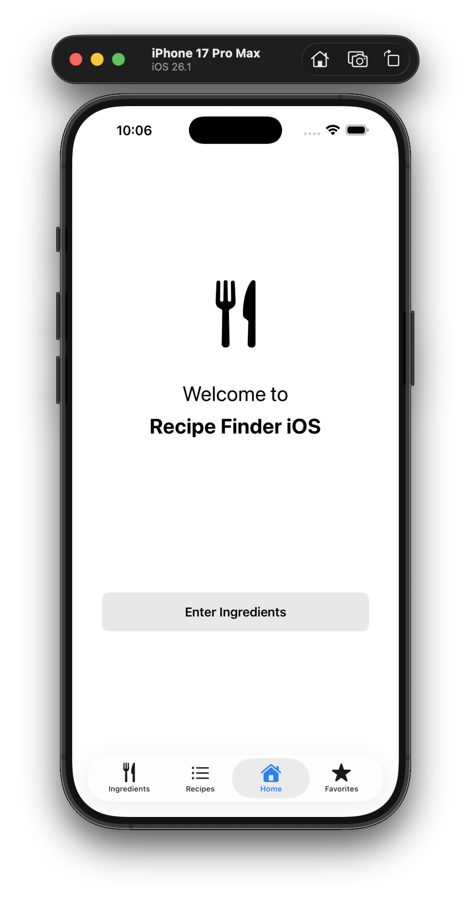
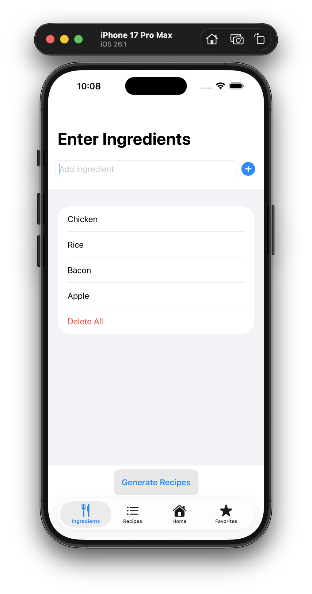
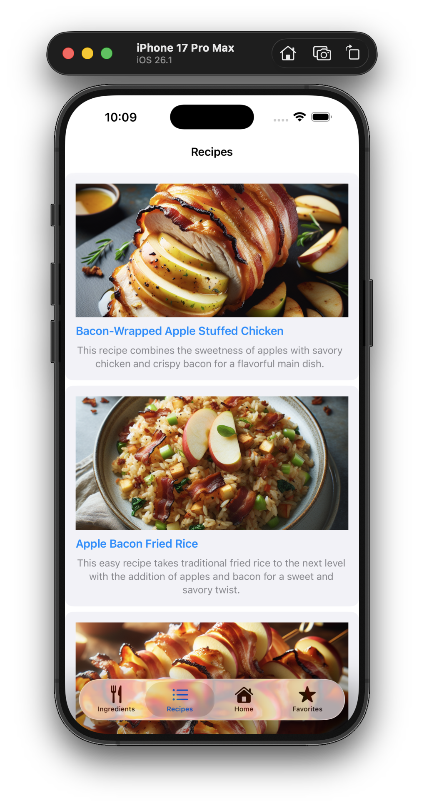
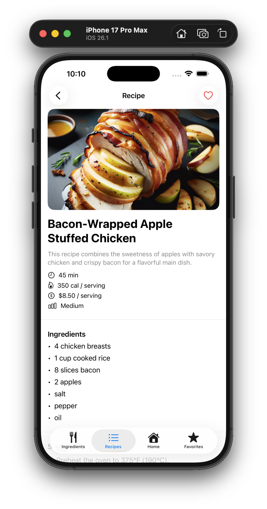
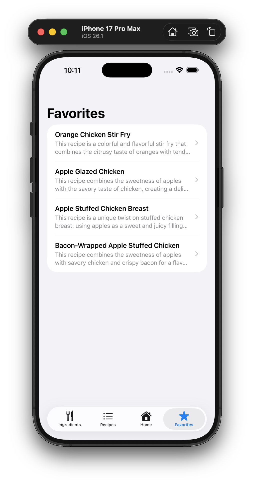

# CPSC-411-Recipe-Finder

    

Recipe Finder is an iOS app built with **SwiftUI** that generates recipes based on ingredients that you already have. It uses the **OpenAI API** to create structured recipe results and **DALL-E-3** to generate matching food images.

---

## Contributors

| Name            | GitHub                                       |
| --------------- | -------------------------------------------- |
| Guido Asbun     | [@guidoasbun](https://github.com/guidoasbun) |
| Ryan Hellewege  | [@rhellwege](https://github.com/rhellwege)   |
| Celeste Garlejo | [@celegarl](https://github.com/celegarl)     |
| Isaiah Padilla  | [@Isaiah714](https://github.com/Isaiah714)   |
---

## Features

- Enter and manage an ingredients list
- Generate multiple recipe ideas using OpenAI (JSON-based output)
- Auto-generate recipe images with DALL-E-3
- View full recipe details (steps, ingredients, etc.)
- Save and manage favorite recipes (persistent)

---

## Tech Stack

- **Swift / SwiftUI**
- **MVVM architecture**
- **Async/Await + TaskGroup** for parallel image generation
- **UserDefaults** for favorites persistence
- **OpenAI API** (Chat Completions + Image Generation)

---

## Architecture Overview (MVVM)

- **Views**: SwiftUI tab-based UI (Home, Ingredients, Recipes, Favorites)
- **ViewModels**:
  - `RecipeViewModel` — manages generating and displaying recipes
  - `FavoritesViewModel` — handles saving/removing favorites
- **Services**:
  - `OpenAIService` — handles all OpenAI API calls

---

## Setup Instructions

1. Clone the repository
2. Open `Recipe Finder.xcodeproj` in Xcode
3. Open `Recipe Finder/Config.swift` and replace the API key:

```swift
import Foundation

struct Config {

    static var openAIAPIKey: String {
        return "######OPEN-AI API KEY######"
    }

    static let defaultRecipeCount = 3

}

```

4. Get your API key from [OpenAI Platform](https://platform.openai.com/api-keys)
5. Build and run on simulator or device (iOS 17+)

---

## Appllication Video Walkthrough

## https://youtu.be/doK4vHW8iuc

## Application Images

|                                      Home                                       |                                          Ingredients                                          |                                        Recipes                                        |                                   Recipe Details                                    |                                         Favorites                                         |
| :-----------------------------------------------------------------------------: | :-------------------------------------------------------------------------------------------: | :-----------------------------------------------------------------------------------: | :---------------------------------------------------------------------------------: | :---------------------------------------------------------------------------------------: |
| <a href="Screenshots/home.png"></a> | <a href="Screenshots/ingredients.png"></a> | <a href="Screenshots/recipes.png"></a> | <a href="Screenshots/recipe.png"></a> | <a href="Screenshots/favorites.png"></a> |

---
